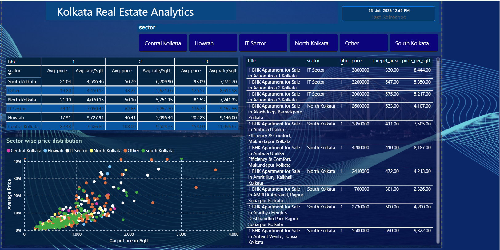

# 🏢 Real Estate Data Pipeline (Medallion Architecture)

An end-to-end automated data pipeline that scrapes, cleans, transforms, and loads Kolkata real estate listing data into a PostgreSQL database using Docker and Python.

---

## 🏗️ Architecture Overview

The pipeline executes a Medallion Architecture data flow:

```text
┌─────────────────┐   ┌─────────────────┐   ┌─────────────────┐
│  1 BHK Scraper  │   │  2 BHK Scraper  │   │  3 BHK Scraper  │
└────────┬────────┘   └────────┬────────┘   └────────┬────────┘
         │                     │                     │
         └─────────────────────┼─────────────────────┘
                               │
                               ▼
                      ┌─────────────────┐
                      │  Bronze Layer   │
                      └────────┬────────┘
                               │
                               ▼
                      ┌─────────────────┐
                      │  Silver Layer   │
                      └────────┬────────┘
                               │
                               ▼
                      ┌─────────────────┐
                      │   Gold Layer    │
                      └────────┬────────┘
                               │
                               ▼
                      ┌─────────────────┐
                      │    Power BI     │
                      └─────────────────┘
```

### Data Pipeline Stages
* **Scrapers:** Independent scrapers collect listing data for 1 BHK, 2 BHK, and 3 BHK properties.
* **Bronze Layer:** Stores raw ingested JSON files partitioned by category.
* **Silver Layer:** Cleans, formats, and standardizes geographic sectors and attributes.
* **Gold Layer:** Consolidates cleaned data into an aggregated model and persists it to PostgreSQL.
* **Power BI:** Connects directly to PostgreSQL for dynamic analytics, pricing trends, and visualization dashboards.

---

## 🛠️ Tech Stack

* **Language:** Python 3.x
* **Data Processing:** Pandas, Pathlib
* **Database:** PostgreSQL
* **Containerization:** Docker, Docker Compose

---

## 📁 Repository Structure

```text
.
├── scripts/
│   ├── scraper.py
│   ├── silver_transform.py
│   └── gold_load.py
├── data/
│   ├── bronze/
│   │   ├── one_bhk_data/
│   │   ├── two_bhk_data/
│   │   └── three_bhk_data/
│   ├── silver/
│   └── gold/
├── docker-compose.yml
├── Dockerfile
├── requirements.txt
├── .gitignore
├── .env
└── README.md
```

## 🚀 Getting Started

### Prerequisites

* [Docker Desktop](https://www.docker.com/products/docker-desktop/) installed and running.
* [Git](https://git-scm.com/) installed on your local machine.

### Installation & Execution

1. **Clone the repository:**
   ```bash
   git clone https://github.com/ks-95/Real-estate-analytics-kolkata.git
   cd Real-estate-analytics-kolkata
   ```

2. **Configure Environment Variables:**
   Create a `.env` file in the root directory:
   ```env
   POSTGRES_USER=postgres
   POSTGRES_PASSWORD=postgres
   POSTGRES_DB=real_estate_db
   POSTGRES_HOST=real_estate_postgres
   POSTGRES_PORT=5432
   ```

3. **Build and Run with Docker Compose:**
   ```bash
   docker-compose up --build
   ```

Once complete, the pipeline will process all bronze files, clean and aggregate them, write to PostgreSQL (`Data saved to Postgres db`), and exit cleanly (`code 0`).
## 📊 Power BI Dashboard



* **Market Analytics:** Visualizes property price distribution, price per sq. ft. across sectors in Kolkata, and unit availability by BHK type.
* **Direct Connection:** Connected directly to the **PostgreSQL Gold Layer** for automated reporting.
